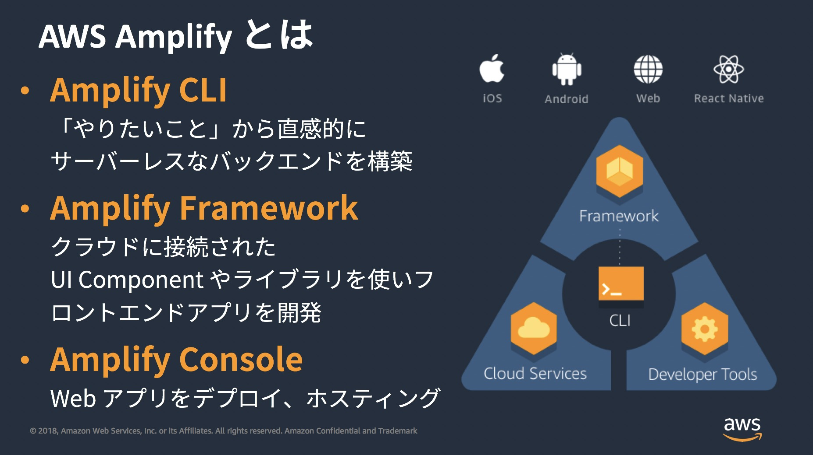

## AWS Amplifyの紹介

---
### 自己紹介
ひらまつです。  
- 仕事：PM(パッケージ導入)　開発は趣味レベル
- 触ったことあり：js/c#/java/python/など
- 好きなもの：ベース/水泳/フェス/サイクリングなど

---
### システム作るときって

  

- DB周り(構築、メンテ)
- API(フロントの要望に合わせて？)
- ファイル管理(セキュリティ？)
- ユーザ管理(認証？権限？)

---
### AWS amplify
Web開発のためのJSライブラリ。
サーバレスなバックエンドを簡単に構築できる！



---

### できること
こちらで説明↓
https://www.slideshare.net/AmazonWebServicesJapan/aws-black-belt-online-seminar-aws-amplify-122274815  

- AWSを使ってサーバレスを実現  
  - DB：DynamoDB  
  - ストレージ：S3  
  - ユーザ管理：cognito  
  - デプロイ：S3+cloudfront  
  - API：API gateway/lambda or Appsync  

---

### API作るとき

```
$ amplify add api
```


```
type Blog @model {
  id: ID!
  name: String!
  posts: [Post] @connection(name: "BlogPosts")
}
type Post @model {
  id: ID!
  title: String!
  blog: Blog @connection(name: "BlogPosts")
  comments: [Comment] @connection(name: "PostComments")
}
type Comment @model {
  id: ID!
  content: String
  post: Post @connection(name: "PostComments")
}
```

---

### ユーザ認証使いたい

```
amplify add auth
```


---

### ファイル管理使いたい

```
amplify add storage
```


```javascript
import { Storage } from "aws-amplify";
// get
Storage.get('welcome.png', { level: 'public' });
// push
Storage.put('test.txt', 'Hello')
    .then (result => console.log(result)) // {key: "test.txt"}
    .catch(err => console.log(err));
```

---

### 今作ってるもの(進行形)
英語アウトプットサービス  
http://localhost:8080/  

- 英語アウトプットの場がほしい
- 日記はネタに困るから、毎日テーマを提供する
- あとは普通のブログサービスと同じ

---

### おわり
Amplifyは、簡単なサービスをすぐ作ってリリースするのには良い。  

(その他)なぜfirebase使わないの？
- GraphQL使ってみたかった
- awsの方が慣れてた
